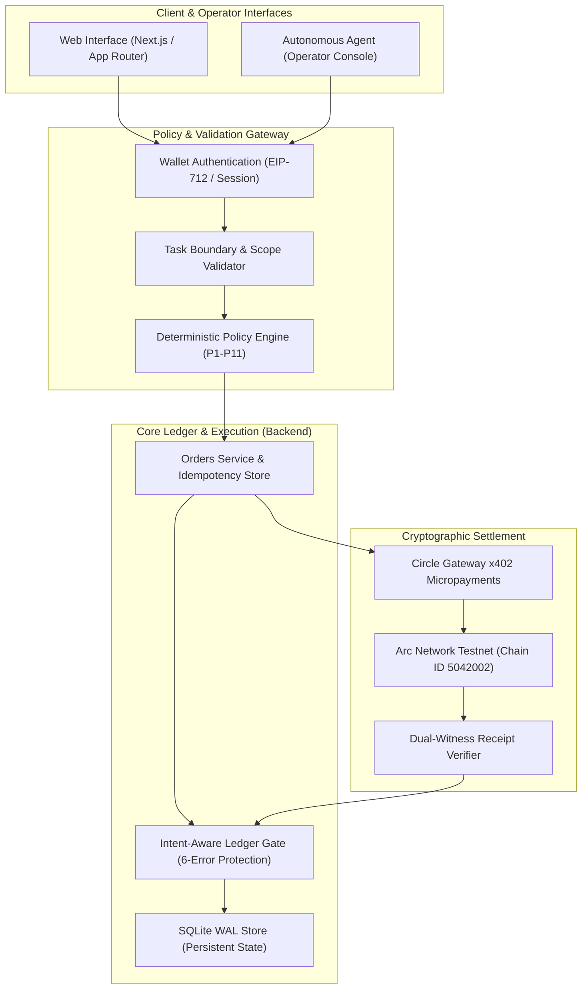
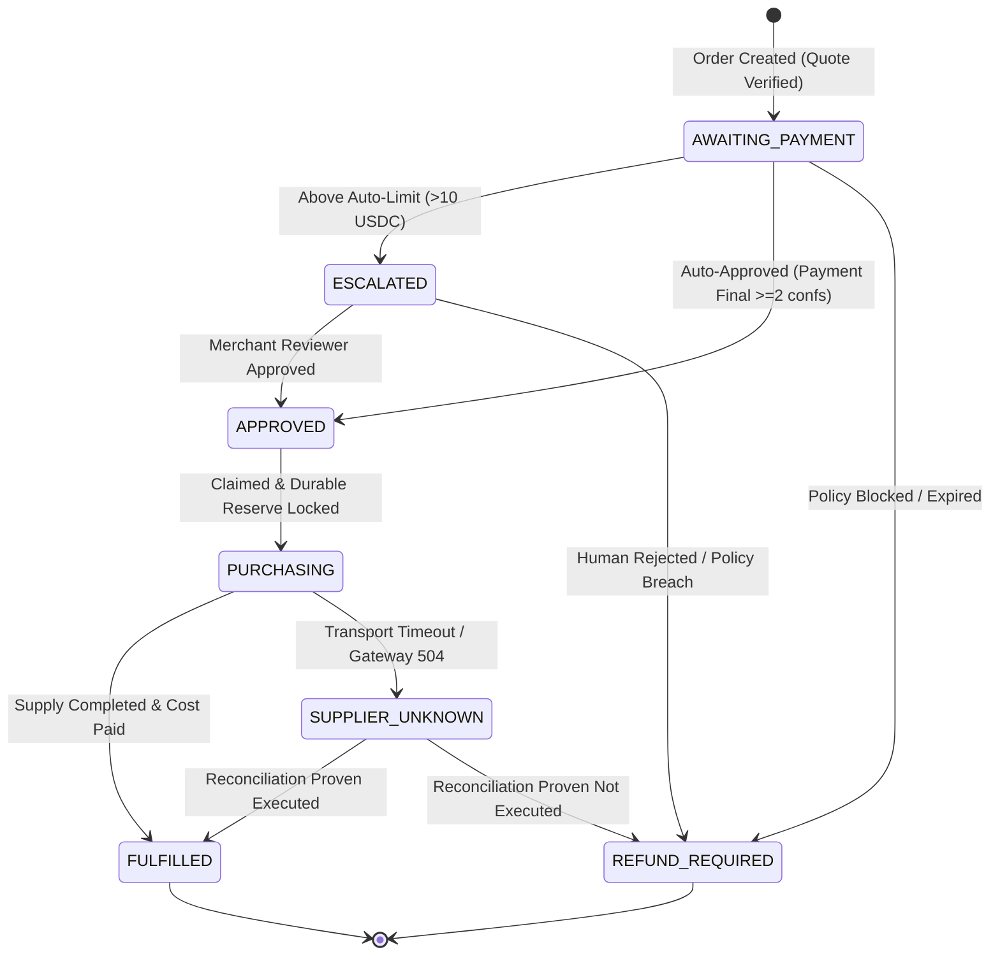
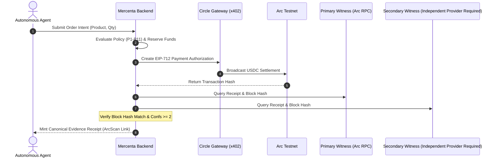

# Mercenta — System Architecture & Trust Boundaries

Mercenta is an institutional commerce and autonomous treasury operator built on the **Circle Agent Stack** and **Arc Network**. This document describes a design model, not proof of deployed end-to-end integration. The new dual-witness and shadow-mode modules are locally tested helpers. One Testnet RPC is configured; a second independent provider and consented pilot evidence are pending. Mainnet remains closed. See [integration review](../submission/INTEGRATION-REVIEW.md).

---

## 1. End-to-End System Architecture

---

## 2. Finite State Machine (FSM) Lifecycle

Orders and procurement actions transition through a deterministic finite state machine where ambiguous transport states are quarantined rather than retried or refunded prematurely.

---

## 3. The 6-Error Intent-Aware Accounting Gate

Drawing from Canteen's *Agents and Ledgers* accounting integrity principles, The regression suite covers six classical accounting-error cases with complete intent witnesses. Optional intent checks do not cover every production posting. External omissions cannot be detected by an internal journal alone; independent reconciliation remains required:

| Error Type | Threat Vector | Mercenta Mitigation Gate |
| :--- | :--- | :--- |
| **Omission** | Transaction occurs but journal entry is omitted | Atomic SQLite transaction wraps order update and journal posting. |
| **Commission** | Transaction posted to the wrong entity or account | Intent validation confirms recipient matches quote specification. |
| **Principle** | Misclassified asset or balance sheet line | Strict account hierarchy (`customer:liability`, `arc:reserved`, `settlement:paid`). |
| **Original Entry / Replay** | Same transaction recorded twice | Durable idempotency keys (`externalEventId` / `order_requests`). |
| **Compensating Error** | Two erroneous entries coincidentally cancel out | Granular line-item amount and direction validation. |
| **Complete Reversal** | Accidental debit/credit inversion | Directional constraint checks fail closed on inverted lines. |

---

## 4. Circle Agent Stack & Dual-Witness Verification

---

## 5. Hackathon Judging Matrix Alignment

*(Note: User-supplied rubric weights and potential prizes are marked as awaiting official sponsor verification.)*

| Hackathon Criterion | Weight* | Mercenta Architectural Implementation |
| :--- | :--- | :--- |
| **Traction & Usability** | 30%* | Shadow-mode helper and dual-witness verifier; real consented pilot volume is not yet attested. |
| **Agentic Sophistication** | 30%* | Deterministic FSM, hardware-like boundary invariants (order ceiling, per-run cap, reserve floor), 6-error ledger gate. |
| **Circle Agent Stack** | 20%* | Circle Gateway x402 integration, EIP-712 authorization, USYC quantitative treasury planning math. |
| **Innovation & Vision** | 20%* | Institutional commerce infrastructure enabling AI agents to purchase developer APIs, compute, and platform keys securely. |

*\*Rubric percentages provided by project owner; awaiting official event guidelines verification.*
